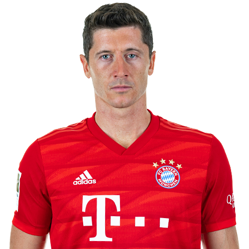

# FC-Bayern-Munich-Face-Recognation

**I have Collected a certain data from google, I collected 100 random pictures of 5 players from Bayern Munich Team, In this Repo, I showed how I collected the data and then applied the Data Cleaning, Preprocessing, Feature Scaling and Feature Engineering, After Cleaning the raw images Each Play to it and then modeling using Machine and deep Learning Algorithms**  

**So Our data is Classification Problem, We have 5 Classes:** 
***Class 0 -> Kingsely Coman*** 

***Class 1 -> Joshua Kimmich*** 

***Class 2 -> Robert Lewandowski*** 

***Class 3 -> Manuel Neuer*** 

***Class 4 -> Leory Sane***  

**You can use the data directly after cleaning, preprocessing, scaling and feature engineering from these link I already Uploaded it on Kaggle: https://www.kaggle.com/eyadgk/fc-bayern-face-recognation**  
